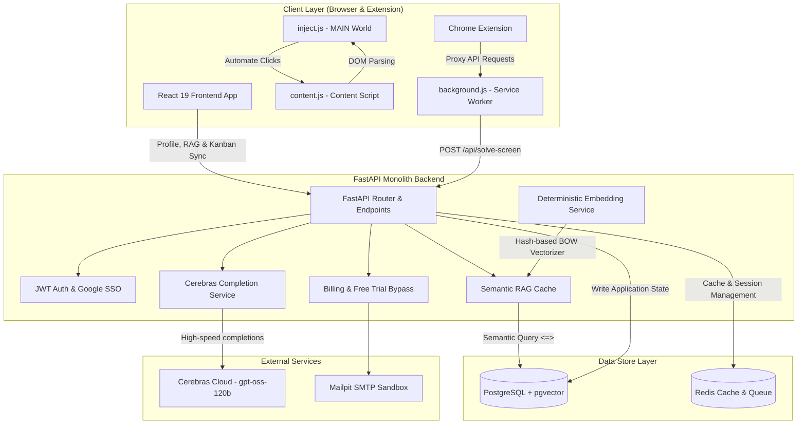
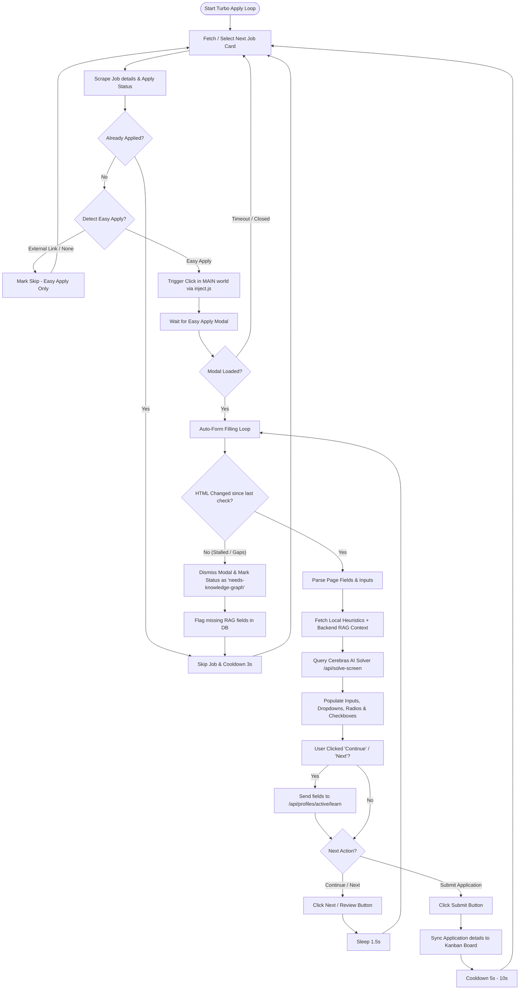
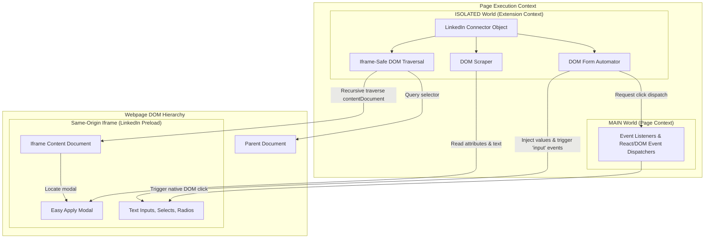

Applying for jobs is arguably the most tedious part of a career search. Between copy-pasting the same profile details, writing customized cover letters for every description, and filling out multi-page application forms, candidates spend hours on repetitive data entry. 

To solve this, I built **AI Job Apply**—an open-source, fully dockerized monorepo application designed to automate the entire job application lifecycle. It uses a semantic **Retrieval-Augmented Generation (RAG)** knowledge base, a zero-dependency local embeddings system, high-speed **Cerebras LLM** inference, and an iframe-safe Chrome extension to auto-fill forms on LinkedIn, Indeed, and ZipRecruiter.

In this post, we’ll dive into the project's architecture, detail how the automation engine handles complex forms, and explain how the system auto-learns from manual corrections.

---

## 💡 The Core Problems & Our Solutions

1. **Repetitive Form Answering:** Standard auto-fillers use rigid class selectors. When a webpage updates or asks custom questions (e.g., *"How many years of experience do you have with React?"*), they break. AI Job Apply solves this by storing answers in a PostgreSQL vector database and resolving questions dynamically using an LLM.
2. **Expensive API Dependencies:** Generating embeddings via OpenAI or Cohere for simple text-matching is expensive and requires an internet connection. AI Job Apply uses a **deterministic token-hashing embedding service** that runs entirely locally with zero external API calls.
3. **Sandbox Iframe Isolation:** Many job boards (particularly LinkedIn) render application forms inside nested `<iframe>` elements to isolate the DOM. Traditional browser extensions cannot access these frames without causing security alerts. Our Chrome extension implements **recursive iframe traversal** and **cross-world click injection** to bypass this.
4. **Knowledge Gaps & Stalls:** Auto-fill bots often get stuck on unanswered fields, resulting in infinite loops or broken submissions. AI Job Apply features **Stall Detection** and a **Knowledge Graph UI**; it flags unanswered questions, skips the job, and lets the user resolve the gap. Once resolved, the system retries the job.

---

## 🏗️ System Architecture

AI Job Apply is structured as a decoupled monorepo containing a FastAPI backend, a React 19 frontend, and a Chrome browser extension. 



### Decoupled Components:
*   **FastAPI Backend (`/backend`):** Exposes Swagger-documented endpoints for profile management, vector database operations, and Cerebras integration.
*   **React 19 Frontend (`/frontend`):** An Obsidian Glassmorphic themed interface. It includes an interactive Kanban board for application tracking and a **Knowledge Graph UI** to visualize and update RAG database entries.
*   **PostgreSQL & `pgvector`:** Stores relational data alongside user knowledge base embeddings. A cosine-distance operator (`<=>`) matches candidate profile answers to dynamically scraped web forms.
*   **Deterministic Token Hashing:** Instead of downloading a heavy model (like BERT) or calling an external API, our backend normalizes words, hashes them deterministically using SHA-256 into indices between `0` and `1535`, builds a bag-of-words vector histogram, and normalizes it to a unit vector.
*   **Cerebras Cloud Completions:** Connects to Cerebras' high-speed inference engine using the `gpt-oss-120b` model. It handles form-solving payloads and generates tailored cover letters dynamically based on candidate resumes and scraped job descriptions.

---

## 🤖 The Turbo Apply Automation Flow

The Chrome Extension runs a state machine called **Turbo Apply**. When active, it manages job searches, parses job descriptions, fills pages, handles verification, and tracks progress.



### Key Elements of the Flow:
*   **Stall Detection:** The extension monitors the modal's HTML state. If it remains unchanged across 6 consecutive checks (~9 seconds of inactivity), the engine assumes it has encountered an unresolved required question or a form lock. Rather than crashing, it closes the modal, marks the job as `needs-knowledge-graph`, and logs the missing question.
*   **Auto-Learning Pipeline:** Whenever a user manually edits a field and clicks "Continue", the extension intercepts the values. It sends the question-answer pair to `/api/profiles/active/learn`, updating the RAG database dynamically so the AI gets smarter with each application.
*   **Turbo Mode Gap Warning:** If the extension detects that the user profile contains unresolved knowledge base questions, it prevents execution and shows a `#kb-warning-alert` banner inside the drawer, protecting the candidate's application quality.

---

## 🧬 Connector Anatomy & Iframe Traversal

A **Connector** is a platform-specific adapter (e.g., LinkedIn, Indeed, ZipRecruiter) loaded by the extension content script. Here is how a connector accesses and interacts with a page:



### Traversal and Injection Details:
1.  **Frame-Aware Selectors:** The connector overrides traditional queries with recursive subframe traversal. If an element isn't found in the parent document, the helper loops through `document.querySelectorAll("iframe")` and inspects `iframe.contentDocument` for same-origin frames.
2.  **Contextual execution:** Instead of executing commands globally, the automator works within the modal's `ownerDocument`. This ensures all inputs, radios, and selects are triggered relative to the frame they inhabit.
3.  **Cross-World Trigger Interceptor:** Since Extensions run in an isolated world, dispatching standard `.click()` events on React-controlled elements can fail to bubble up. The extension injects `inject.js` into the `MAIN` page world, acting as an event proxy to dispatch native user click and keyboard events that bypass React's virtual DOM traps.

---

## 🚀 How to Try it Out

The project is fully dockerized and ready for local development:

### 1. Build and Start Services
Navigate to the infrastructure folder and start the stack:
```bash
cd infra
docker compose up -d --build
```
This launches:
*   **React Frontend:** `http://localhost:5173`
*   **FastAPI Backend:** `http://localhost:8000`
*   **PostgreSQL & pgvector** (Port `5432`)
*   **Redis** (Port `6379`)
*   **Mailpit SMTP Sandbox:** `http://localhost:18025`

### 2. Seed the Database
Populate the database with test profiles, mock candidates, and pre-configured promocodes:
```bash
docker compose exec backend python seed.py
```
*Tip: You can use the mock candidate credentials `kkumar.sandeep89@gmail.com` with password `password`.*

### 3. Run Integration Tests
Verify endpoint routing, RAG search, and completion logic by running the test suite:
```bash
python3 backend/test_endpoints.py
```

### 4. Pro Tier Billing Bypass
To unlock advanced RAG capabilities and unlimited LLM solvers without setting up Stripe keys, enter the promocode `FREETRIAL` at the pricing checkout screen. This bypasses payment gateways and activates premium privileges directly in the PostgreSQL database.

---

## 🛠️ Tech Stack Recap

*   **Backend:** FastAPI, SQLAlchemy 2.0+, Alembic, PostgreSQL, pgvector, Redis, PyPDF, Cerebras SDK.
*   **Frontend:** React 19, Vite, Tailwind CSS v4, Axios, React Router v7.
*   **Browser Extension:** Vanilla Javascript, Chrome Extension Manifest V3, Playwright (for simulation monitors).

Check out the full repository and start automating your search:
👉 **[job-apply-ai GitHub Repository](https://github.com/vishwakarma09/job-apply-ai)**
