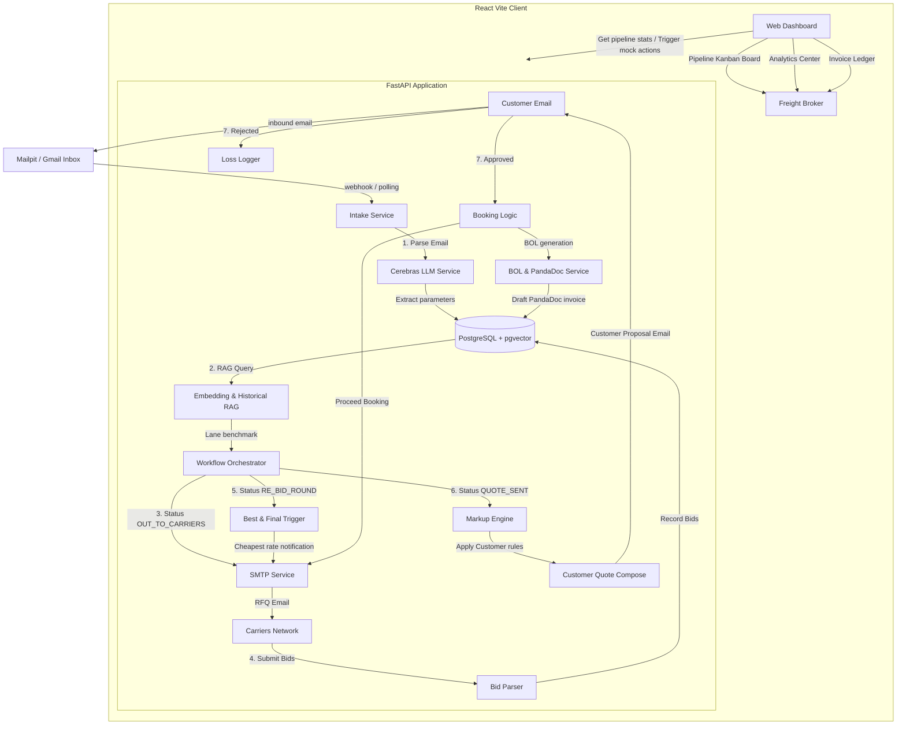
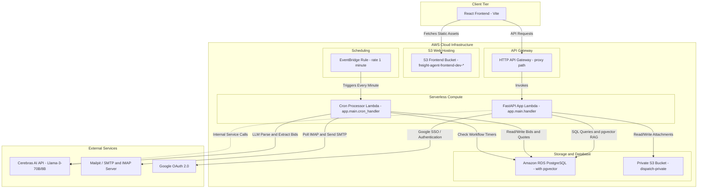
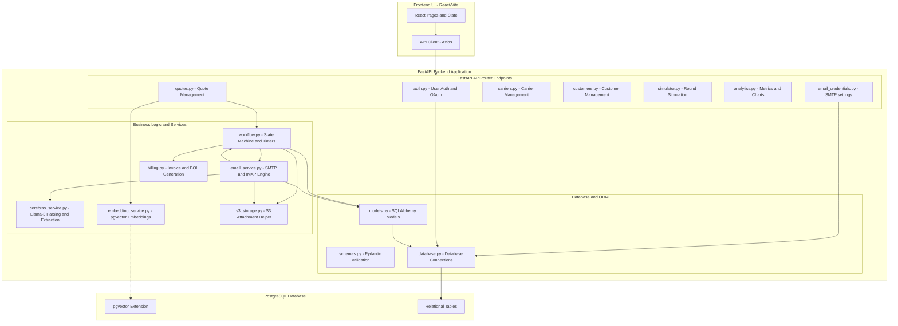

In the logistics industry, freight brokers act as middle-men between shippers (customers) who need cargo moved and carriers (trucking companies) who own the assets to transport it. Historically, this matching process is incredibly manual: a broker receives a free-text email from a customer, parses the shipment lanes, copies the details into multiple emails to carriers to solicit quotes, waits for bids, triggers a negotiation round, adds a margin, proposes a price back to the customer, and finally drafts a Bill of Lading (BOL).

To automate this high-friction email loop, I created **Freight Agent AWS**—an automated competitive freight bidding platform. Built using a serverless architecture on **AWS Lambda, API Gateway, and Amazon S3**, it orchestrates the entire bidding lifecycle using **Cerebras LLM (Llama-3.1)** for sub-second email intelligence, and **PostgreSQL with pgvector** to match historical shipping lane data.

In this post, we'll walk through the system's architecture, explain the bidding cycle, and break down the anatomy of the email connector that acts as the platform's nervous system.

---

## 💡 The Problem: The Manual Email Bottleneck

Freight brokers are constantly flooded with unstructured inquiry emails containing shipping requests like:
> *"Need a quote for 4 pallets of class 70 auto parts from Detroit, MI to Laredo, TX for next Tuesday. Weight is 8,500 lbs, dock-to-dock, no hazmat."*

A typical broker must:
1.  **Parse details manually** (Origin, Destination, Weight, Class, Hazmat status).
2.  **Benchmark the lane** using historical spreadsheet rates to estimate standard costs.
3.  **Email multiple carriers** to request quotes.
4.  **Manage bidding deadlines** and follow up to get the best pricing.
5.  **Trigger a Re-Bid round** to let carriers lower their rates when margins are tight.
6.  **Apply markups and propose** the final quote to the customer.

By automating this sequence, brokers can handle 10x the volume, eliminate data-entry errors, and secure the lowest carrier costs in real-time.

---

## 🏗️ 1. Core Quote State & Bid Cycle Flow

The lifecycle of a quote is managed by a state machine that transitions across 10 stages: `INTAKE` -> `OUT_TO_CARRIERS` -> `FIRST_ROUND_RECEIVED` -> `RE_BID_ROUND` -> `QUOTE_SENT` -> `AWAITING_APPROVAL` -> `APPROVED` -> `IN_TRANSIT` -> `COMPLETED` -> `LOST`.

Here is how the automated workflow operates when an inquiry arrives:



### Flow Highlights
*   **Intake Parsing:** A Python ingestion service watches the broker's mailbox. When an email is fetched, **Cerebras Llama-3.1-70B** extracts key logistics attributes in sub-second inference speed.
*   **Historical Lane RAG:** The backend vectorizes the shipping lane (e.g. Detroit to Laredo) and queries the PostgreSQL database using **pgvector** similarity search (`<=>`) to fetch historical prices, helping the broker benchmark the bids.
*   **Automated Carrier RFQs:** The engine automatically emails a selected network of carriers with an RFQ. As carriers reply with pricing and transit times, the email system parses the values and inserts them into the DB.
*   **Re-Bid Trigger:** If a carrier submits a bid, the orchestrator triggers a time-bound "Re-Bid Round", alerting other carriers of the current lowest price (without revealing identity) to drive down costs.
*   **Approval & BOL Drafting:** Once the bid window closes, the broker approves the best price on their React Kanban board. The system automatically creates a Bill of Lading (BOL), syncs details to the invoice ledger, and drafts booking confirmations.

---

## ☁️ 2. AWS Serverless Architecture

To make this application highly scalable, cost-efficient, and easy to maintain, it is built entirely using serverless components on AWS. The FastAPI backend is adapted to AWS Lambda via Mangum, and S3 is utilized for both static web hosting and attachment storage.



### AWS Infrastructure breakdown:
*   **FastAPI API Lambda:** Standard endpoints (e.g. quotes tracking, carrier listings, analytics summaries) are served via API Gateway routing HTTP traffic directly into a FastAPI Lambda function.
*   **Cron Processor Lambda:** A decoupled cron Lambda is invoked every minute by **Amazon EventBridge** to poll the IMAP mail server, process new emails, check active bidding timers, and transition quotes across workflow statuses.
*   **Amazon RDS PostgreSQL:** Host database storing structured carrier data, billing logs, and vector embeddings using the `pgvector` extension.
*   **Amazon S3:** The React UI is hosted statically in an S3 Bucket. A private S3 bucket is also set up to host generated files like Bill of Ladings, invoices, and email attachments.

---

## 🧬 3. Modular Application Architecture

The application's backend codebase is structured modularly. This makes it simple to add new router paths, plug in custom markup logic, or swapping LLM models.



---

## 🔌 4. The Email Connector Anatomy

The **Email Connector** is the gateway connecting our system to the external email servers. It implements a bi-directional integration:
1.  **Inbound Email Processing (IMAP):** Connects to the inbox, fetches unread emails, extracts attachments, extracts the Quote ID (e.g. `Q-1002`) using regex, parses payloads using Cerebras AI, and triggers state transitions.
2.  **Outbound Email Processing (SMTP):** composes styled HTML templates, injects workflow-driven parameters (like margins and bidding instructions), and dispatches emails.

Here is the architectural anatomy of how the email connector interacts with external mailboxes, AI systems, and storage buckets:

```mermaid
graph TD
    subgraph EmailServer ["Email Server / Sandbox (Gmail / Mailpit)"]
        Mailbox["Broker's Mailbox"]
        SMTPHost["SMTP Server (Port 587/1025)"]
        IMAPHost["IMAP Server (Port 993/143)"]
    end

    subgraph ConnectorAnatomy ["Email Connector Anatomy"]
        subgraph InboundFlow ["Inbound Connector (IMAP Client)"]
            IMAPPoller["IMAP Client Poller"]
            EmailParser["MIME parser (email.message)"]
            RegexRouter["Regex ID Extractor (Q-XXXX)"]
            LLMParser["Cerebras AI Parser (Llama 3.1)"]
            WorkflowRouter["Workflow Transition Engine"]
        end

        subgraph OutboundFlow ["Outbound Connector (SMTP Client)"]
            SMTPSender["SMTP Client Sender"]
            HTMLComposer["HTML Email Composer"]
        end
    end

    subgraph DataStore ["Database & Storage"]
        DB[("Amazon RDS Postgres")]
        S3Bucket[("S3 Attachments Bucket")]
    end

    %% Interactions
    IMAPHost -->|Fetches raw MIME| IMAPPoller
    IMAPPoller --> EmailParser
    EmailParser --> RegexRouter
    RegexRouter -->|Quote ID matched| WorkflowRouter
    RegexRouter -->|No Quote ID (New Inquiry)| LLMParser
    LLMParser -->|Extracts lane metadata| WorkflowRouter
    
    WorkflowRouter -->|Save quotes/bids| DB
    EmailParser -->|Extract PDF BOL/Attachments| S3Bucket

    HTMLComposer -->|Generates HTML payload| SMTPSender
    SMTPSender -->|Sends SMTP traffic| SMTPHost
    
    DB -->|Trigger RFQ/Proposal| HTMLComposer
```

### Connector Operations:
*   **The Mailbox Poller (`IMAP`):** Loops through the inbox. For every email fetched, it generates a hash key. It uses a `ProcessedEmail` table in the database to prevent duplicate processing.
*   **The Regex Router:** A fast check matches string tags like `Q-\d{4}` in the email subject or body.
    *   **If a match is found:** The email is classified as a reply. The system checks if it is a customer approval/rejection or a carrier bid, and updates the quote.
    *   **If no match is found:** The email is treated as a new inquiry. The raw text is passed to Cerebras LLM to parse out location coordinates, carrier requirements, and weight.
*   **The HTML Template Composer:** Composes highly structured logistics documents. For carriers, it templates a bid solicitation. For customers, it templates a markup proposal showing historical lane competitiveness scores to validate the rates.

---

## 🚀 How to Deploy the Serverless Stack

The stack is configured to deploy directly to AWS using the **Serverless Framework (v3)**.

### 1. Build and Deploy API Gateway + Lambda
Initialize your AWS credentials locally, install the NPM plugins, and run:
```bash
npm install
npx serverless deploy --stage dev
```
This automatically packs the Python code into a Lambda layer, provisions the API Gateway HTTP routes, registers the EventBridge scheduler rules, and sets up execution roles.

### 2. Deploy Frontend to S3
The React Vite application can be built and synced to its hosting bucket using the deploy script:
```bash
./deploy_frontend.sh dev
```
The script resolves your AWS Account ID, compiles the frontend bundle using the correct API Gateway URL, syncs the assets to S3, and prints the public HTTP endpoint of the broker UI.

---

## 🛠️ Tech Stack Recap

*   **Backend Core:** Python 3.11, FastAPI, Mangum, SQLAlchemy, PostgreSQL (pgvector).
*   **Serverless Infrastructure:** Serverless Framework, AWS Lambda, API Gateway, Amazon S3, EventBridge.
*   **AI Engine:** Cerebras Cloud SDK (Llama-3.1-70b-preview) for instant completions and parsing.
*   **Frontend Client:** React 18, Vite, Tailwind CSS, Axios, Lucide Icons, Recharts.

Check out the full repository and set up your serverless bidding broker agent:
👉 **[freight-agent-aws GitHub Repository](https://github.com/vishwakarma09/freight-agent-aws)**
